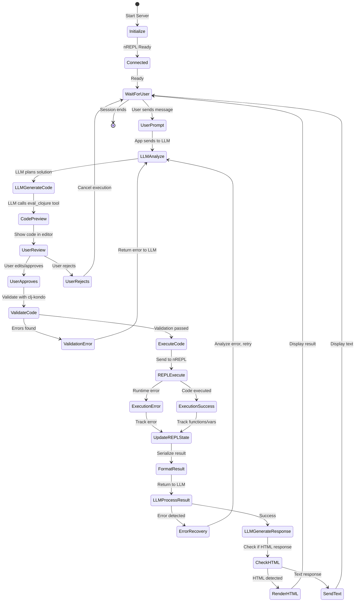
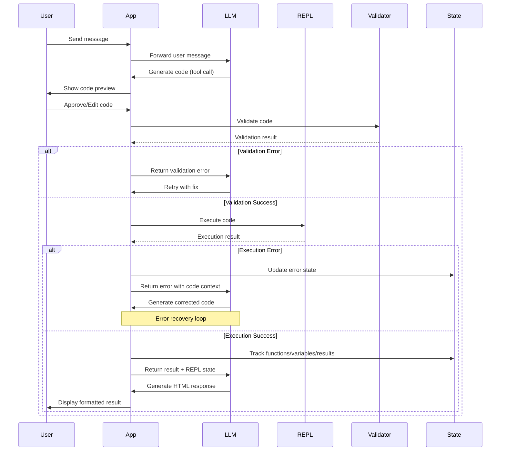

# REPL Chat

Interactive REPL interface with AI integration using Babashka nREPL. An LLM-powered tool that executes Clojure code through a single `eval_clojure` function, enabling natural language interaction with your system.

## Overview

REPL Chat provides a web-based interface where you can chat with an AI assistant that can execute Clojure code via Babashka nREPL. Instead of a fixed set of tools, the LLM has access to the full Clojure runtime, allowing it to dynamically generate and execute code to accomplish tasks. The LLM can learn from previous executions, reuse functions and results, and automatically recover from errors.

## Features

- **REPL State Awareness**: Tracks functions, variables, and results across the conversation session
- **Result Binding**: Use `;; bind-result` comment to save execution results for later use
- **Code Validation**: Pre-execution validation using `clj-kondo` to catch syntax and type errors
- **Conversation History**: Persistent conversation history stored in SQLite database
- **HTML Visualization**: Results rendered in isolated iframe for safe display
- **State Management**: Clear REPL state button to reset functions, variables, and results

## Requirements

- Node.js (v18+)
- Babashka (`bb` command available in PATH)
- `clj-kondo` (optional, for code validation - defaults to `clj-kondo` in PATH)
- LLM model endpoint (Ollama running locally or API key for cloud services)

## Installation

```bash
npm install
```

## Configuration

Edit `config.json` to configure AI models and behavior:

```json
{
  "models": {
    "local": {
      "name": "local",
      "endpoint": "http://localhost:11434/v1",
      "apiKey": "ollama",
      "model": "qwen3:8b",
      "temperature": 0.7,
      "maxTokens": 4096
    },
    "deepseek": {
      "name": "deepseek",
      "endpoint": "https://api.deepseek.com/v1",
      "apiKey": "${DEEPSEEK_API_KEY}",
      "model": "deepseek-chat",
      "temperature": 0.7,
      "maxTokens": 4096
    }
  },
  "defaultModel": "deepseek",
  "systemPrompt": "...",
  "codeValidation": {
    "enabled": true,
    "cljKondoPath": "clj-kondo"
  }
}
```

### Configuration Options

- **models**: Object mapping model names to their configuration
  - **endpoint**: API endpoint URL
  - **apiKey**: API key (use `${VAR_NAME}` for environment variable substitution)
  - **model**: Model identifier
  - **temperature**: Sampling temperature (0.0-2.0)
  - **maxTokens**: Maximum tokens in response
- **defaultModel**: Name of the default model to use
- **systemPrompt**: System prompt for the AI (includes REPL state awareness, error handling, etc.)
- **codeValidation**: Code validation settings
  - **enabled**: Enable/disable clj-kondo validation
  - **cljKondoPath**: Path to clj-kondo executable

### Environment Variables

Environment variables can override config values:
- `AI_DEFAULT_MODEL`: Default model to use
- `DEEPSEEK_API_KEY`: DeepSeek API key (or any API key for your model)
- `NREPL_HOSTNAME` / `NREPL_PORT`: Connect to existing nREPL server instead of starting new one
- `BABASHKA_PATH`: Path to Babashka executable (default: `bb`)

## Usage

Start the server:

```bash
npm start
```

Open `http://localhost:3000` in your browser and start chatting. The AI will:
1. Interpret your request
2. Generate appropriate Clojure code
3. Show you a preview of the code (editable)
4. Execute it via Babashka nREPL after your approval
5. Return formatted HTML results

### Code Preview & Editing

Before execution, you'll see a "Generated Code - Edit and Review Before Execution" dialog with:
- Syntax-highlighted Clojure code editor (CodeMirror)
- Ability to edit the code before execution
- Approve or reject buttons

### Result Binding

To save a result for later use in the conversation, add `;; bind-result` to your code:

```clojure
(require '[babashka.fs :as fs])
(defn list-files [] (fs/list-dir "."))
;; bind-result
(list-files)
```

The result will be bound to `*last-result*` and available in subsequent tool responses via `replState.lastResult`.

### REPL State Management

The LLM automatically tracks:
- **Functions**: All `defn`, `defmacro`, `defmethod` definitions with signatures and docstrings
- **Variables**: All `def` statements
- **Results**: Last execution result and recent result history

Use the "Clear REPL State" button to reset all tracked state for the current session.

### Example Interactions

**You**: "List all files in the current directory"

**AI**: Generates and executes:
```clojure
(require '[babashka.fs :as fs])
(map str (fs/list-dir "."))
```

**Result**: Returns formatted HTML table with file list

**You**: "Now show only the largest file"

**AI**: Reuses the previous result and filters:
```clojure
(require '[babashka.fs :as fs])
(let [files *last-result*]
  (apply max-key #(fs/size (:path %)) files))
```

## Testing

Run the test suite:

```bash
npm test
```

## Architecture

The system follows an 8-step loop:

1. **Initialize**: Connect to nREPL, inject helper functions, register `eval_clojure` tool
2. **Prompt**: User provides task via WebSocket
3. **Decide**: LLM analyzes and plans Clojure code
4. **Request**: LLM calls `eval_clojure` with generated code
5. **Preview**: Code shown to user for review/editing (CodeMirror editor)
6. **Execute**: User approves → nREPL evaluates code (with validation)
7. **Respond**: Results serialized, REPL state updated, returned to LLM
8. **Answer**: LLM synthesizes final HTML response

### Execution Flow Diagram



### Component Interaction Diagram



### Error Recovery Loop

When code execution fails:
1. Error details (including the problematic code) are sent to LLM
2. LLM analyzes the error and generates corrected code
3. Process repeats until success or user cancellation

### REPL State Tracking

- **Function Tracking**: Automatically extracts function definitions from executed code
- **Variable Tracking**: Tracks `def` statements for variables
- **Result History**: Maintains last 10 execution results
- **State Persistence**: State persists for entire conversation session
- **State Clearing**: Manual button to clear all tracked state

### Code Validation

- **Pre-execution**: All code validated with `clj-kondo` before execution
- **Error Detection**: Catches syntax errors, type errors, missing requires
- **Warning Handling**: Warnings don't block execution, only errors do
- **Error Reporting**: Detailed line/column information in error messages

## Project Structure

```
repl-chat/
├── src/
│   ├── app.js              # Main application entry point
│   ├── ai-client.js        # AI client with conversation management
│   ├── nrepl-server.js     # Babashka nREPL server management
│   ├── nrepl-client.js     # nREPL client for code execution
│   ├── result-handler.js   # Result serialization and visualization
│   ├── code-validator.js   # clj-kondo validation
│   ├── repl-state.js       # REPL state tracking per session
│   ├── code-analyzer.js    # Code analysis for function/variable extraction
│   ├── clojure-discovery.js # Namespace and function discovery
│   ├── clojure-helpers.js  # Helper functions injected into REPL
│   ├── config.js           # Configuration loading
│   └── db.js               # SQLite conversation history
├── public/
│   ├── index.html          # Web interface
│   ├── app.js              # Client-side JavaScript
│   └── style.css           # Styling
├── test/                   # Test suite
├── config.json             # Configuration file
└── package.json            # Dependencies and scripts
```

## License

MIT
